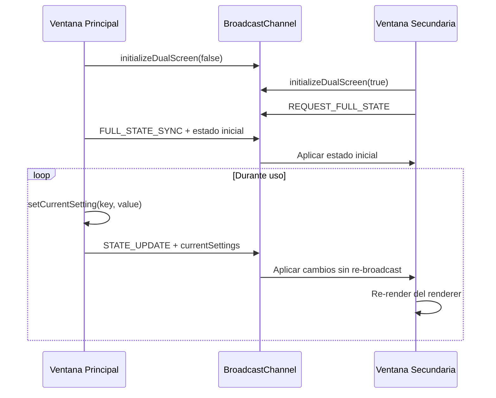

# Sistema de Doble Pantalla para LuxSequencer

## Resumen

Este sistema permite utilizar LuxSequencer con dos pantallas simultáneamente:
- **Pantalla principal**: Muestra los controles, secuenciador y vista previa
- **Pantalla secundaria**: Muestra únicamente el renderer en pantalla completa para proyección

## Arquitectura Implementada

### 1. BroadcastChannel API

Se eligió `BroadcastChannel` sobre `localStorage` por las siguientes ventajas:

**✅ BroadcastChannel**
- API nativa del navegador (sin dependencias)
- Eventos en tiempo real (no polling)
- Mejor performance
- No satura el localStorage
- Comunicación bidireccional

**❌ localStorage (descartado)**
- Requiere polling constante
- Problemas de performance con actualizaciones frecuentes
- Saturación del storage con datos temporales
- Eventos inconsistentes entre navegadores

### 2. Componentes Implementados

#### `/store/slices/dualScreen.slice.ts`
Slice de Zustand que maneja:
- Estado de ventanas abiertas
- Canal de comunicación BroadcastChannel
- Detección de ventana secundaria
- Sincronización de estado completo

#### `/store/middleware/dualScreen.middleware.ts`
Middleware que intercepta cambios de estado para sincronización automática (implementación futura para optimización).

#### `/components/dualscreen/DualScreenManager.tsx`
Componente manager que:
- Inicializa BroadcastChannel según tipo de ventana
- Intercepta métodos críticos (`setCurrentSetting`, `loadPattern`, `setProject`)
- Sincroniza cambios automáticamente
- Maneja cleanup al desmontar

#### `/components/dualscreen/SecondaryDisplay.tsx`
Pantalla dedicada para visualización:
- Solo muestra el renderer en pantalla completa
- Auto-hide del cursor tras 3s de inactividad
- Entrada automática en fullscreen
- Respeta viewport modes (desktop/mobile)
- Overlay informativo temporal

#### `/components/dualscreen/DualScreenControls.tsx`
Controles UI:
- Botón toggle en header principal
- Iconos diferenciados (single/dual screen)
- Estados visuales (activo/inactivo)
- No aparece en ventana secundaria

### 3. Flujo de Sincronización



### 4. Propiedades Sincronizadas

El sistema sincroniza automáticamente:

```typescript
{
  currentSettings: ControlSettings,    // Todas las propiedades de control
  project: Project,                    // Proyecto completo
  activeSequenceIndex: number,         // Secuencia activa
  textureRotation: number,            // Rotación de textura
  transitionProgress: number,          // Progreso de transiciones
  previousGradient: GradientColor[],   // Gradiente previo (para shaders)
  previousBackgroundGradient: GradientColor[], // Fondo previo
  sequencerCurrentStep: number,        // Paso actual del secuenciador
  viewportMode: string                 // Modo de viewport
}
```

### 5. Detección de Ventana Secundaria

La ventana secundaria se identifica por URL parameter:
```
http://localhost:3000/                    # Ventana principal
http://localhost:3000/?display=secondary  # Ventana secundaria
```

### 6. Estados de la Aplicación

#### Ventana Principal
- Muestra interfaz completa (controles + preview)
- Maneja toda la lógica de negocio
- Envía actualizaciones via BroadcastChannel
- Controla apertura/cierre de ventana secundaria

#### Ventana Secundaria
- Solo recibe y aplica actualizaciones
- Muestra únicamente el renderer
- Solicita estado inicial al conectar
- Notifica cuando se cierra

## Uso

### Activar Doble Pantalla

1. Hacer clic en el botón de doble pantalla en el header (icono de pantallas)
2. Se abrirá automáticamente una nueva ventana en modo secundario
3. Mover la ventana secundaria a la segunda pantalla
4. La ventana secundaria entrará automáticamente en fullscreen

### Flujo de Trabajo Típico

1. **Setup inicial**: Configurar controles en ventana principal
2. **Activar dual screen**: Click en botón de doble pantalla  
3. **Posicionar ventanas**: Arrastrar ventana secundaria a pantalla de proyección
4. **Performance**: Usar controles en pantalla principal, visualización en secundaria
5. **Control live**: MIDI, secuenciador y ajustes se reflejan en tiempo real

### Atajos de Teclado (Ventana Secundaria)

- `ESC`: Salir de pantalla completa
- `Ctrl+W`: Cerrar ventana secundaria
- **Mouse idle 3s**: Ocultar cursor automáticamente

## Ventajas de la Implementación

### Performance
- **Cero latencia**: Actualizaciones en tiempo real via BroadcastChannel
- **Selectivo**: Solo sincroniza propiedades necesarias para rendering
- **Eficiente**: No duplica lógica de negocio en ventana secundaria

### Usabilidad
- **Plug & play**: Un solo clic para activar
- **Auto-fullscreen**: Ventana secundaria optimizada para proyección
- **Viewport modes**: Respeta configuraciones de aspecto ratio
- **Feedback visual**: Estados claros en controles UI

### Robustez
- **Auto-recovery**: Detecta ventanas cerradas automáticamente
- **State sync**: Ventana secundaria siempre refleja estado actual
- **Fallback graceful**: Funciona sin ventana secundaria abierta
- **Cross-browser**: BroadcastChannel soportado en navegadores modernos

## Limitaciones Conocidas

1. **Same-origin**: Solo funciona entre ventanas del mismo dominio
2. **Popup blockers**: Algunos navegadores pueden bloquear ventana secundaria
3. **BroadcastChannel support**: Requiere navegadores modernos (IE11+ no soportado)
4. **Performance**: Con animaciones complejas puede haber ligero delay

## Alternativas Evaluadas

### WebRTC DataChannels
- **Pro**: Comunicación peer-to-peer ultra-rápida
- **Con**: Complejidad innecesaria, overkill para uso local
- **Veredicto**: Reservado para futura expansión a control remoto

### PostMessage + window.open()
- **Pro**: Control total sobre ventana secundaria
- **Con**: API más verbosa, requiere más gestión manual
- **Veredicto**: BroadcastChannel es más elegante

### SharedWorker
- **Pro**: Estado compartido persistente entre pestañas
- **Con**: Complejidad adicional, menos soporte de navegadores
- **Veredicto**: BroadcastChannel es suficiente

### localStorage + polling
- **Pro**: Máxima compatibilidad
- **Con**: Performance inferior, polling constante
- **Veredicto**: BroadcastChannel ofrece mejor UX

## Expansiones Futuras

### Control Remoto (WebRTC)
Permitir que la ventana de control esté en un dispositivo diferente (tablet, otro PC) usando WebRTC DataChannels.

### Multi-Display
Soporte para más de 2 pantallas simultáneas con diferentes configuraciones de renderer.

### Presets de Ventana
Guardar posiciones y tamaños de ventanas para configuraciones de escenario repetitivas.

### Touch Controls
Interfaz optimizada para tablets cuando se usa como control remoto.

## Troubleshooting

### La ventana secundaria no se abre
- Verificar que no esté bloqueada por popup blocker
- Probar manualmente: `window.open('/?display=secondary')`

### Sin sincronización entre ventanas
- Abrir DevTools y verificar console errors
- Comprobar soporte de BroadcastChannel: `'BroadcastChannel' in window`
- Verificar que ambas ventanas estén en el mismo dominio

### Performance degradada
- Reducir frecuencia de actualizaciones en controles con animación continua
- Verificar que no haya múltiples ventanas secundarias abiertas
- Monitorear uso de CPU en DevTools Performance tab
