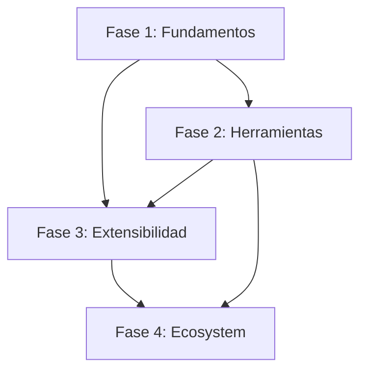

# Arquitectura del Sistema de Renderers

## Introducción

El sistema de renderers de LuxSequencer está diseñado para ser completamente modular y extensible, permitiendo a desarrolladores terceros crear sus propios motores de renderizado con plena libertad creativa. Cada renderer es un módulo independiente que se integra perfectamente al sistema a través de una interfaz bien definida.

## Arquitectura General

### 1. Registro Central (`src/components/renderers/index.ts`)

El sistema utiliza un registro central donde todos los renderers se almacenan en un objeto con claves únicas:

```typescript
import type { RendererDefinition } from './types';

export const renderers: Record<string, RendererDefinition> = {
  [webglRenderer.id]: webglRenderer,
  [concentricRenderer.id]: concentricRenderer,
};

export type RendererId = keyof typeof renderers;
```

Esta arquitectura permite:
- **Registro dinámico**: Fácil adición/eliminación de renderers
- **Tipado fuerte**: TypeScript genera automáticamente los tipos válidos  
- **Desacoplamiento**: Cada renderer es completamente independiente

### 2. Definición de Renderer (`src/components/renderers/types.ts`)

Cada renderer debe implementar la interfaz `RendererDefinition`:

```typescript
export interface RendererDefinition {
  id: string;                                    // Identificador único
  name: string;                                  // Nombre de visualización
  component: React.FC<{ className?: string }>;  // Componente React principal
  controlSchema: AccordionItem[] | (() => AccordionItem[]); // Esquema de controles
}
```

#### Características clave:
- **ID único**: Identificador para el registro y referencia
- **Componente React**: Total libertad en la implementación del renderer
- **Schema flexible**: Puede ser un array estático o función dinámica
- **Integración CSS**: Soporte completo para clases CSS personalizadas

### 3. Sistema de Controles (`AccordionItem[]`)

Los controles se definen mediante un sistema de esquemas declarativo:

```typescript
// Tipos de controles soportados
export type AccordionItem = ControlSection | SeparatorSection;

export interface ControlSection {
  title: string;
  defaultOpen?: boolean;
  controls: ControlConfig[];
}

export type ControlConfig = SliderControlConfig | CustomControlConfig;
```

#### Tipos de controles disponibles:

**Controles Slider:**
```typescript
export interface SliderControlConfig {
  type: 'slider';
  id: keyof ControlSettings;
  label: string;
  min: number;
  max: number;
  step: number;
  formatter: (value: number) => string;
}
```

**Controles Personalizados:**
```typescript
export interface CustomControlConfig {
  type: 'custom';
  id: string;
  component: React.FC;
}
```

## Implementación Práctica

### Estructura de Archivos Recomendada

```
src/components/renderers/yourrenderer/
├── YourRenderer.tsx          # Componente React principal
├── your-schema.ts            # Schema de controles
└── index.ts                  # Export de RendererDefinition
```

### Ejemplo Completo: Renderer Simple

#### 1. Componente Principal (`YourRenderer.tsx`)

```typescript
import React, { useEffect, useRef } from 'react';
import { useTextureStore } from '../../../store';
import type { ControlSettings } from '../../../types';

const YourRenderer: React.FC<{ className?: string }> = ({ className }) => {
  const canvasRef = useRef<HTMLCanvasElement>(null);
  const animationId = useRef<number | null>(null);
  
  // Suscripción automática a cambios de settings
  const currentSettings = useTextureStore(state => state.currentSettings);

  useEffect(() => {
    const canvas = canvasRef.current;
    if (!canvas) return;
    
    const ctx = canvas.getContext('2d');
    if (!ctx) return;

    const render = () => {
      // Tu lógica de renderizado aquí
      // currentSettings contiene todos los parámetros actuales
      drawYourVisuals(ctx, currentSettings);
      animationId.current = requestAnimationFrame(render);
    };

    render();

    // Cleanup obligatorio
    return () => {
      if (animationId.current) {
        cancelAnimationFrame(animationId.current);
      }
    };
  }, [currentSettings]); // Re-ejecutar cuando cambien los settings

  return <canvas ref={canvasRef} className={className} />;
};

export default YourRenderer;
```

#### 2. Schema de Controles (`your-schema.ts`)

```typescript
import React from 'react';
import { useTextureStore } from '../../../store';
import { t } from '../../../i18n';
import type { AccordionItem } from '../../../types';

// Componente personalizado para control de color
const ColorPicker: React.FC = () => {
  const color = useTextureStore(state => state.currentSettings.your_color);
  const { setCurrentSetting } = useTextureStore.getState();
  
  return (
    <input
      type="color"
      value={color}
      onChange={(e) => setCurrentSetting('your_color', e.target.value)}
      className="w-full h-10 rounded border border-gray-600"
    />
  );
};

export const getYourSchema = (): AccordionItem[] => [
  {
    title: t('section.appearance'),
    defaultOpen: true,
    controls: [
      {
        type: 'slider',
        id: 'your_size',
        label: t('controls.size'),
        min: 10,
        max: 200,
        step: 1,
        formatter: (v) => `${v}px`
      },
      {
        type: 'slider',
        id: 'your_speed',
        label: t('controls.speed'),
        min: 0.1,
        max: 5.0,
        step: 0.1,
        formatter: (v) => `${v.toFixed(1)}x`
      }
    ]
  },
  
  // Separador visual
  { type: 'separator', id: 'sep-1' },
  
  {
    title: t('section.colors'),
    controls: [
      {
        type: 'custom',
        id: 'colorPicker',
        component: ColorPicker
      }
    ]
  }
];
```

#### 3. Registro del Renderer (`index.ts`)

```typescript
import { RendererDefinition } from '../types';
import YourRenderer from './YourRenderer';
import { getYourSchema } from './your-schema';

export const yourRenderer: RendererDefinition = {
  id: 'your-renderer',
  name: 'Mi Renderer Personalizado',
  component: YourRenderer,
  controlSchema: getYourSchema,
};
```

#### 4. Registro Global

Agregar a `src/components/renderers/index.ts`:

```typescript
import { yourRenderer } from './yourrenderer';

export const renderers: Record<string, RendererDefinition> = {
  [webglRenderer.id]: webglRenderer,
  [concentricRenderer.id]: concentricRenderer,
  [yourRenderer.id]: yourRenderer, // ← Agregar aquí
};
```

### Extensión del Sistema de Settings

Para nuevos parámetros, actualizar `src/types.ts`:

```typescript
export interface ControlSettings {
  // ... settings existentes
  
  // Nuevos settings para tu renderer
  your_size?: number;
  your_speed?: number;
  your_color?: string;
}
```

## Integración con el Sistema

### 1. Suscripción Automática a Estado

Los renderers se suscriben automáticamente a cambios mediante Zustand:

```typescript
// ✅ Correcto: Suscripción reactiva
const currentSettings = useTextureStore(state => state.currentSettings);

// ❌ Incorrecto: No reactivo
const { currentSettings } = useTextureStore.getState();
```

### 2. Manejo de Animaciones

El sistema proporciona múltiples fuentes de cambio con prioridades:

```typescript
export enum ControlSource {
  PatternSequencer = 0,  // Prioridad más baja
  PropertySequencer = 1,
  UI = 2,
  MIDI = 3               // Prioridad más alta
}
```

Los renderers no necesitan manejar estas prioridades; el sistema lo hace automáticamente.

### 3. MIDI Learn Automático

Todos los controles `slider` obtienen automáticamente soporte para MIDI Learn sin código adicional:

```typescript
// Este control será automáticamente mapeable vía MIDI
{
  type: 'slider',
  id: 'your_parameter',
  label: 'Mi Parámetro',
  // ... resto de configuración
}
```

### 4. Interpolación de Valores

Las transiciones entre patrones se manejan automáticamente:

```typescript
// El sistema interpola automáticamente entre valores
// cuando se cargan patrones o se ejecuta el sequencer
useEffect(() => {
  // Este efecto se ejecutará con valores interpolados
  updateYourRenderer(currentSettings);
}, [currentSettings]);
```

## Renderers Existentes

### 1. WebGL Scale Renderer (`src/components/renderers/webgl/`)

**Características:**
- Shader GLSL personalizado para texturas procedurales
- 20+ parámetros configurables (size, spacing, morphing, etc.)
- Gradientes multi-color con hard stops
- Rotación en tiempo real
- Formas morfables (círculos → diamantes → estrellas)

**Complejidad:** ★★★★★  
**Tecnología:** WebGL 2.0, Fragment Shaders

### 2. Concentric Renderer (`src/components/renderers/concentric/`)

**Características:**
- Canvas 2D para hexágonos concéntricos
- Animación radial con timing configurable
- Sistema de colores por gradiente
- Crecimiento orgánico desde el centro

**Complejidad:** ★★★☆☆  
**Tecnología:** Canvas 2D, RequestAnimationFrame

## Hoja de Ruta: Oportunidades de Mejora

Las siguientes mejoras están organizadas en fases estratégicas para maximizar el impacto y minimizar riesgos de implementación. Cada fase construye sobre la anterior, creando una base sólida para el crecimiento del ecosistema de renderers.

---

## 🚀 FASE 1: Fundamentos Arquitectónicos
*Objetivo: Establecer bases sólidas y estables*  
*Duración estimada: 2-3 sprints*  
*Prioridad: CRÍTICA*

### 1.1. Sistema de Tipos más Flexible

**Problema Actual:**
```typescript
// Todos los settings están en una interfaz monolítica
export interface ControlSettings {
  scaleSize: number;           // Solo para WebGL
  concentric_speed?: number;   // Solo para Concentric
  // 20+ propiedades más...
}
```

**Mejora Propuesta:**
```typescript
// Settings específicos por renderer
export interface RendererSettings<T = any> {
  [rendererId: string]: T;
}

export interface ControlSettings {
  common: CommonSettings;      // Settings compartidos
  renderer: RendererSettings; // Settings específicos
}
```

**Beneficios:**
- Mejor organización del código
- Prevención de conflictos de nombres
- Tipo de seguridad más fuerte
- Facilita testing individual

**Justificación Fase 1:** Base fundamental que impacta toda la arquitectura. Debe implementarse antes que cualquier sistema avanzado.

---

### 1.2. Sistema de Validación y Hot Reload

**Problema Actual:**
Los renderers no tienen validación de configuraciones ni mecanismos de recuperación ante errores.

**Mejora Propuesta:**
```typescript
export interface RendererDefinition {
  // ... propiedades existentes
  
  validate?: (settings: ControlSettings) => ValidationResult;
  hotReload?: boolean; // Soporte para hot-reload en desarrollo
  version?: string;    // Versionado de renderers
  
  // Nuevas capacidades de validación
  settingsValidation?: {
    [key: string]: ValidationRule[];
  };
  
  // Error recovery
  errorRecovery?: {
    fallbackSettings: Partial<ControlSettings>;
    onError: (error: Error, settings: ControlSettings) => Partial<ControlSettings>;
  };
}

export interface ValidationResult {
  valid: boolean;
  errors: ValidationError[];
  warnings: ValidationWarning[];
}

export interface ValidationRule {
  type: 'range' | 'required' | 'custom';
  message: string;
  validator: (value: any, settings: ControlSettings) => boolean;
}

// Sistema de validación automática
export const validateRendererSettings = (
  renderer: RendererDefinition,
  settings: ControlSettings
): ValidationResult => {
  const errors: ValidationError[] = [];
  const warnings: ValidationWarning[] = [];
  
  // Validar según schema
  const schema = typeof renderer.controlSchema === 'function' 
    ? renderer.controlSchema() 
    : renderer.controlSchema;
  
  schema.forEach(section => {
    if ('controls' in section) {
      section.controls.forEach(control => {
        if (control.type === 'slider') {
          const value = settings[control.id] as number;
          if (value < control.min || value > control.max) {
            errors.push({
              field: control.id,
              message: `${control.label} must be between ${control.min} and ${control.max}`,
              currentValue: value
            });
          }
        }
      });
    }
  });
  
  // Validaciones custom del renderer
  if (renderer.validate) {
    const customResult = renderer.validate(settings);
    errors.push(...customResult.errors);
    warnings.push(...customResult.warnings);
  }
  
  return {
    valid: errors.length === 0,
    errors,
    warnings
  };
};
```

**Justificación Fase 1:** Esencial para estabilidad y experiencia de desarrollo. Previene errores que podrían romper la aplicación.

---

### 1.3. Error Handling y Fallbacks

**Problema Actual:**
No hay manejo de errores centralizado ni fallbacks cuando un renderer falla.

**Mejora Propuesta:**
```typescript
export interface RendererDefinition {
  // ... propiedades existentes
  
  errorBoundary?: React.ComponentType<ErrorBoundaryProps>;
  fallbackRenderer?: string;
  errorRecovery?: (error: Error) => ControlSettings | null;
  
  // Configuración de robustez
  robustness?: {
    gracefulDegradation: boolean;
    maxRetries: number;
    retryDelay: number;
  };
}

// Error boundary especializado para renderers
export class RendererErrorBoundary extends React.Component<
  { children: React.ReactNode; renderer: RendererDefinition },
  { hasError: boolean; error?: Error }
> {
  constructor(props) {
    super(props);
    this.state = { hasError: false };
  }

  static getDerivedStateFromError(error: Error) {
    return { hasError: true, error };
  }

  componentDidCatch(error: Error, errorInfo: React.ErrorInfo) {
    console.error(`Renderer Error: ${this.props.renderer.id}`, error, errorInfo);
    
    // Intentar recuperación automática
    if (this.props.renderer.errorRecovery) {
      const recoverySettings = this.props.renderer.errorRecovery(error);
      if (recoverySettings) {
        useTextureStore.getState().applySettings(recoverySettings);
        this.setState({ hasError: false });
        return;
      }
    }
    
    // Fallback a renderer alternativo
    if (this.props.renderer.fallbackRenderer) {
      useTextureStore.getState().changeRenderer(this.props.renderer.fallbackRenderer);
    }
  }

  render() {
    if (this.state.hasError) {
      return (
        <div className="flex items-center justify-center h-full bg-red-900/20 text-red-400">
          <div className="text-center">
            <h2 className="text-xl font-bold mb-2">Renderer Error</h2>
            <p className="mb-4">El renderer {this.props.renderer.name} ha encontrado un error.</p>
            <button 
              className="px-4 py-2 bg-red-600 text-white rounded"
              onClick={() => this.setState({ hasError: false })}
            >
              Reintentar
            </button>
          </div>
        </div>
      );
    }

    return this.props.children;
  }
}
```

**Justificación Fase 1:** Fundamental para estabilidad del sistema. Un renderer con errores no debe romper toda la aplicación.

---

### 1.4. Sistema de Controles Declarativo Centralizado

**Problema Actual:**
Los renderers son responsables de renderizar sus propios controles UI, lo que genera:
- Inconsistencias visuales entre diferentes renderers
- Duplicación de código para controles similares
- Mayor complejidad para desarrolladores terceros
- Dificultad para aplicar cambios de diseño globalmente
- Limitaciones en funcionalidades automáticas (themes, accesibilidad, responsive)

**Mejora Propuesta:**
Sistema híbrido donde los renderers declaran especificaciones de controles y la aplicación se encarga de renderizarlos.

```typescript
// Nuevo sistema declarativo expandido
export interface RendererControlSpec {
  // 90% de casos: controles estándar completamente declarativos
  standard: StandardControlSpec[];
  
  // 10% de casos: componentes custom para casos especiales
  custom?: CustomControlSpec[];
}

export interface StandardControlSpec {
  id: keyof ControlSettings;
  type: ControlType;
  category: string;
  label: string;
  constraints: ControlConstraints;
  
  // Metadata para generación automática
  metadata?: {
    description?: string;
    tooltip?: string;
    units?: string;
    presets?: PresetValue[];
    dependencies?: PropertyDependency[]; // Controles que dependen de otros
  };
}

export type ControlType = 
  | 'slider' 
  | 'color' 
  | 'gradient' 
  | 'select' 
  | 'toggle'
  | 'vector2d'    // Nuevo: control X,Y
  | 'range'       // Nuevo: min/max range
  | 'curve'       // Nuevo: curva de animación
  | 'matrix'      // Nuevo: matriz de valores
  | 'text';       // Nuevo: input de texto

export interface ControlConstraints {
  slider?: SliderConstraints;
  color?: ColorConstraints;
  gradient?: GradientConstraints;
  select?: SelectConstraints;
  vector2d?: Vector2DConstraints;
  // ... otros tipos
}

export interface SliderConstraints {
  min: number;
  max: number;
  step: number;
  logarithmic?: boolean;
  formatter: (value: number) => string;
  
  // Nuevas características avanzadas
  curves?: 'linear' | 'ease-in' | 'ease-out' | 'ease-in-out';
  bipolar?: boolean; // Para controles que van de -N a +N con 0 en el centro
  detents?: number[]; // Valores que "atraen" el control
}

export interface GradientConstraints {
  minColors: number;
  maxColors: number;
  allowHardStops: boolean;
  presetPalettes?: ColorPalette[];
  colorSpace?: 'rgb' | 'hsl' | 'lab';
}

export interface Vector2DConstraints {
  xRange: [number, number];
  yRange: [number, number];
  lockAspectRatio?: boolean;
  polarMode?: boolean; // Mostrar como radio/ángulo en lugar de X/Y
}

export interface PropertyDependency {
  property: keyof ControlSettings;
  condition: (value: any) => boolean;
  effect: 'show' | 'hide' | 'enable' | 'disable';
}

// Sistema de generación automática de controles
export class ControlRenderer {
  private components = new Map<ControlType, React.FC<any>>();
  
  constructor() {
    // Registrar componentes built-in
    this.register('slider', SliderControl);
    this.register('color', ColorControl);
    this.register('gradient', GradientControl);
    this.register('vector2d', Vector2DControl);
    // ... etc
  }
  
  register(type: ControlType, component: React.FC<any>): void {
    this.components.set(type, component);
  }
  
  render(spec: StandardControlSpec, value: any, onChange: (value: any) => void): React.ReactElement {
    const Component = this.components.get(spec.type);
    if (!Component) {
      throw new Error(`Unknown control type: ${spec.type}`);
    }
    
    return React.createElement(Component, {
      spec,
      value,
      onChange,
      key: spec.id
    });
  }
}

// Ejemplo de schema declarativo mejorado
export const getWebGLSchema = (): RendererControlSpec => ({
  standard: [
    {
      id: 'scaleSize',
      type: 'slider',
      category: 'Scale Configuration',
      label: 'Scale Size',
      constraints: {
        slider: {
          min: 45,
          max: 400,
          step: 1,
          formatter: (v) => `${v}px`,
          detents: [100, 200, 300] // Valores que "atraen"
        }
      },
      metadata: {
        description: 'Controls the size of individual scale elements',
        tooltip: 'Larger values create bigger scales, smaller values create finer detail'
      }
    },
    
    {
      id: 'gradientColors',
      type: 'gradient',
      category: 'Colors',
      label: 'Scale Gradient',
      constraints: {
        gradient: {
          minColors: 2,
          maxColors: 10,
          allowHardStops: true,
          colorSpace: 'rgb'
        }
      }
    },
    
    {
      id: 'animationVector',
      type: 'vector2d',
      category: 'Animation',
      label: 'Animation Direction',
      constraints: {
        vector2d: {
          xRange: [-1, 1],
          yRange: [-1, 1],
          polarMode: true // Mostrar como velocidad + ángulo
        }
      },
      metadata: {
        description: 'Controls animation direction and speed'
      }
    },
    
    {
      id: 'enableAdvanced',
      type: 'toggle',
      category: 'Advanced',
      label: 'Enable Advanced Controls',
      constraints: {},
      metadata: {
        description: 'Shows additional advanced configuration options'
      }
    },
    
    {
      id: 'advancedSetting',
      type: 'slider',
      category: 'Advanced',
      label: 'Advanced Parameter',
      constraints: {
        slider: { min: 0, max: 100, step: 1, formatter: (v) => `${v}%` }
      },
      metadata: {
        dependencies: [
          {
            property: 'enableAdvanced',
            condition: (value) => value === true,
            effect: 'show'
          }
        ]
      }
    }
  ],
  
  // Solo para casos realmente especiales
  custom: [
    {
      id: 'specializedControl',
      component: MySpecializedComponent,
      category: 'Special'
    }
  ]
});
```

**Control Components Centralizados:**

```typescript
// Componente slider mejorado con características avanzadas
const SliderControl: React.FC<{
  spec: StandardControlSpec;
  value: number;
  onChange: (value: number) => void;
}> = ({ spec, value, onChange }) => {
  const constraints = spec.constraints.slider!;
  
  return (
    <div className="space-y-2">
      {/* Label con tooltip */}
      <div className="flex items-center justify-between">
        <label className="font-medium text-gray-300 flex items-center gap-2">
          {spec.label}
          {spec.metadata?.tooltip && (
            <TooltipIcon tooltip={spec.metadata.tooltip} />
          )}
        </label>
        <span className="text-sm font-mono bg-gray-700 text-cyan-300 px-2 py-1 rounded">
          {constraints.formatter(value)}
        </span>
      </div>
      
      {/* Slider con detents */}
      <div className="relative">
        <input
          type="range"
          min={constraints.min}
          max={constraints.max}
          step={constraints.step}
          value={value}
          onChange={(e) => onChange(Number(e.target.value))}
          className={`
            w-full h-2 bg-gray-700 rounded-lg appearance-none cursor-pointer
            ${constraints.bipolar ? 'slider-bipolar' : ''}
          `}
        />
        
        {/* Detents visuales */}
        {constraints.detents?.map(detent => (
          <div
            key={detent}
            className="absolute w-1 h-4 bg-gray-500 rounded-full transform -translate-x-1/2 top-1/2 -translate-y-1/2"
            style={{
              left: `${((detent - constraints.min) / (constraints.max - constraints.min)) * 100}%`
            }}
          />
        ))}
      </div>
      
      {/* Presets si están disponibles */}
      {spec.metadata?.presets && (
        <div className="flex gap-1 flex-wrap">
          {spec.metadata.presets.map(preset => (
            <button
              key={preset.name}
              onClick={() => onChange(preset.value)}
              className="text-xs px-2 py-1 bg-gray-800 hover:bg-gray-700 rounded"
            >
              {preset.name}
            </button>
          ))}
        </div>
      )}
    </div>
  );
};

// Control Vector2D completamente nuevo
const Vector2DControl: React.FC<{
  spec: StandardControlSpec;
  value: { x: number; y: number };
  onChange: (value: { x: number; y: number }) => void;
}> = ({ spec, value, onChange }) => {
  const constraints = spec.constraints.vector2d!;
  
  if (constraints.polarMode) {
    // Mostrar como radio + ángulo
    const radius = Math.sqrt(value.x * value.x + value.y * value.y);
    const angle = Math.atan2(value.y, value.x) * (180 / Math.PI);
    
    return (
      <div className="space-y-3">
        <label className="font-medium text-gray-300">{spec.label}</label>
        <div className="grid grid-cols-2 gap-4">
          <div>
            <label className="text-sm text-gray-400">Speed</label>
            <input
              type="range"
              min={0}
              max={Math.max(...constraints.xRange.map(Math.abs))}
              step={0.01}
              value={radius}
              onChange={(e) => {
                const newRadius = Number(e.target.value);
                const angleRad = angle * (Math.PI / 180);
                onChange({
                  x: newRadius * Math.cos(angleRad),
                  y: newRadius * Math.sin(angleRad)
                });
              }}
              className="w-full"
            />
          </div>
          <div>
            <label className="text-sm text-gray-400">Angle</label>
            <input
              type="range"
              min={-180}
              max={180}
              step={1}
              value={angle}
              onChange={(e) => {
                const newAngle = Number(e.target.value) * (Math.PI / 180);
                onChange({
                  x: radius * Math.cos(newAngle),
                  y: radius * Math.sin(newAngle)
                });
              }}
              className="w-full"
            />
          </div>
        </div>
        <div className="text-xs text-gray-500">
          Speed: {radius.toFixed(2)} | Angle: {angle.toFixed(1)}°
        </div>
      </div>
    );
  }
  
  // Modo X/Y normal con visualización 2D
  return (
    <div className="space-y-3">
      <label className="font-medium text-gray-300">{spec.label}</label>
      
      {/* Visualización 2D interactiva */}
      <div className="relative w-full h-32 bg-gray-800 rounded border-2 border-gray-600">
        <div
          className="absolute w-3 h-3 bg-cyan-400 rounded-full transform -translate-x-1/2 -translate-y-1/2 cursor-pointer"
          style={{
            left: `${((value.x - constraints.xRange[0]) / (constraints.xRange[1] - constraints.xRange[0])) * 100}%`,
            top: `${(1 - (value.y - constraints.yRange[0]) / (constraints.yRange[1] - constraints.yRange[0])) * 100}%`
          }}
          onMouseDown={(e) => {
            // Implementar drag & drop
          }}
        />
      </div>
      
      {/* Controles numéricos */}
      <div className="grid grid-cols-2 gap-4">
        <div>
          <label className="text-sm text-gray-400">X</label>
          <input
            type="number"
            value={value.x}
            onChange={(e) => onChange({ ...value, x: Number(e.target.value) })}
            min={constraints.xRange[0]}
            max={constraints.xRange[1]}
            step={0.01}
            className="w-full px-2 py-1 bg-gray-700 border border-gray-600 rounded text-sm"
          />
        </div>
        <div>
          <label className="text-sm text-gray-400">Y</label>
          <input
            type="number"
            value={value.y}
            onChange={(e) => onChange({ ...value, y: Number(e.target.value) })}
            min={constraints.yRange[0]}
            max={constraints.yRange[1]}
            step={0.01}
            className="w-full px-2 py-1 bg-gray-700 border border-gray-600 rounded text-sm"
          />
        </div>
      </div>
    </div>
  );
};
```

**Beneficios del Sistema Centralizado:**

1. **Consistencia Total**: Todos los controles siguen el mismo diseño y comportamiento
2. **Funcionalidades Automáticas**: Themes, accesibilidad, responsive design se aplican globalmente
3. **Desarrollo Simplificado**: Los desarrolladores de renderers solo definen especificaciones
4. **Mantenimiento Centralizado**: Bugs y mejoras se aplican a todos los renderers
5. **Extensibilidad Controlada**: Nuevos tipos de controles benefician a todo el ecosistema
6. **Características Avanzadas**: Dependencias, presets, tooltips disponibles automáticamente
7. **Testing Unificado**: Un solo conjunto de tests para todos los tipos de controles

**Migración Gradual:**

```typescript
// Fase 1: Mantener compatibilidad con sistema actual
export interface RendererDefinition {
  id: string;
  name: string;
  component: React.FC<{ className?: string }>;
  
  // Sistema antiguo (deprecated)
  controlSchema?: AccordionItem[] | (() => AccordionItem[]);
  
  // Sistema nuevo
  controls?: RendererControlSpec;
}

// Durante migración: fallback automático al sistema antiguo
const renderControls = (renderer: RendererDefinition) => {
  if (renderer.controls) {
    return <StandardControlRenderer spec={renderer.controls} />;
  } else if (renderer.controlSchema) {
    return <LegacyControlRenderer schema={renderer.controlSchema} />;
  }
  return null;
};
```

**Casos de Uso Avanzados:**

```typescript
// Control dependiente que aparece solo bajo ciertas condiciones
{
  id: 'detailedSettings',
  type: 'slider',
  category: 'Advanced',
  label: 'Detail Level',
  constraints: { /* ... */ },
  metadata: {
    dependencies: [
      {
        property: 'renderMode',
        condition: (value) => value === 'high-quality',
        effect: 'show'
      }
    ]
  }
}

// Control con presets automáticos
{
  id: 'animationSpeed',
  type: 'slider',
  category: 'Animation',
  label: 'Speed',
  constraints: {
    slider: {
      min: 0.1,
      max: 5.0,
      step: 0.1,
      formatter: (v) => `${v}x`
    }
  },
  metadata: {
    presets: [
      { name: 'Slow', value: 0.5 },
      { name: 'Normal', value: 1.0 },
      { name: 'Fast', value: 2.0 },
      { name: 'Extreme', value: 4.0 }
    ]
  }
}
```

**Justificación Fase 1:** Esta mejora establece las bases fundamentales para un sistema de controles consistente, mantenible y extensible. Es prerequisito para funcionalidades avanzadas y debe implementarse antes que sistemas de extensiones o marketplace. La migración gradual minimiza riesgos mientras maximiza beneficios a largo plazo.

---

## 🛠️ FASE 2: Herramientas de Desarrollo
*Objetivo: Potenciar el desarrollo y debugging*  
*Duración estimada: 3-4 sprints*  
*Prioridad: ALTA*

### 2.1. Performance Monitoring Integrado

**Problema Actual:**
Los renderers no pueden declarar dependencias externas (shaders, texturas, modelos 3D).

**Mejora Propuesta:**
```typescript
export interface RendererDefinition {
  id: string;
  name: string;
  component: React.FC<{ className?: string }>;
  controlSchema: AccordionItem[] | (() => AccordionItem[]);
  
  // Nuevas propiedades
  assets?: {
    shaders?: string[];
    textures?: string[];
    models?: string[];
  };
  dependencies?: string[];      // Librerías npm opcionales
  capabilities?: RendererCapability[]; // Características soportadas
}
```

### 3. Sistema de Validación y Hot Reload

**Mejora Propuesta:**
```typescript
export interface RendererDefinition {
  // ... propiedades existentes
  
  validate?: (settings: ControlSettings) => ValidationResult;
  hotReload?: boolean; // Soporte para hot-reload en desarrollo
  version?: string;    // Versionado de renderers
}
```

### 4. Renderer Composition System

**Concepto:**
Permitir que los renderers se compongan de otros renderers más simples:

```typescript
export interface CompositeRenderer {
  id: string;
  name: string;
  layers: RendererLayer[];
  blendModes: BlendMode[];
}

export interface RendererLayer {
  renderer: string;
  opacity: number;
  transform: TransformMatrix;
}
```

### 5. Performance Monitoring Integrado

**Problema Actual:**
Los renderers no tienen visibilidad sobre su rendimiento real en producción, dificultando la optimización y debug de problemas de performance.

**Mejora Propuesta:**
Sistema integrado de métricas de rendimiento con recolección automática y dashboard visual.

```typescript
export interface RendererMetrics {
  // Métricas básicas de renderizado
  fps: number;              // FPS actual promediado
  renderTime: number;       // Tiempo en ms por frame
  frameDrops: number;       // Frames perdidos en último segundo
  
  // Métricas de memoria
  memoryUsage: number;      // MB usados por el renderer
  memoryLeaks: boolean;     // Detección de memory leaks
  
  // Métricas específicas de tecnología
  gpuUtilization?: number;  // Para renderers WebGL/WebGPU
  canvasOperations?: number; // Para renderers Canvas 2D
  
  // Métricas de usuario
  settingsChanges: number;  // Cambios de configuración por minuto
  errorCount: number;       // Errores capturados
}

export interface PerformanceThresholds {
  minFps: number;           // FPS mínimo aceptable
  maxRenderTime: number;    // Tiempo máximo por frame
  maxMemoryUsage: number;   // Límite de memoria MB
}

// Hook automático para renderers
export const useRenderMetrics = (
  rendererId: string,
  thresholds?: PerformanceThresholds
) => {
  const [metrics, setMetrics] = useState<RendererMetrics>();
  const [alerts, setAlerts] = useState<PerformanceAlert[]>([]);
  
  useEffect(() => {
    const monitor = new PerformanceMonitor(rendererId);
    
    // Configurar thresholds personalizados
    if (thresholds) {
      monitor.setThresholds(thresholds);
    }
    
    // Callback para métricas en tiempo real
    monitor.onMetrics((newMetrics) => {
      setMetrics(newMetrics);
      
      // Alertas automáticas
      const newAlerts = monitor.checkThresholds(newMetrics);
      if (newAlerts.length > 0) {
        setAlerts(prev => [...prev, ...newAlerts]);
      }
    });
    
    return () => monitor.cleanup();
  }, [rendererId]);
  
  return { 
    metrics, 
    alerts,
    exportReport: () => monitor.generateReport(),
    resetMetrics: () => monitor.reset()
  };
};

// Ejemplo de uso en un renderer
const YourRenderer: React.FC<{ className?: string }> = ({ className }) => {
  const { metrics, alerts } = useRenderMetrics('your-renderer', {
    minFps: 30,
    maxRenderTime: 16.67, // 60fps = 16.67ms por frame
    maxMemoryUsage: 100    // 100MB máximo
  });
  
  // Mostrar alertas en desarrollo
  useEffect(() => {
    if (env.VITE_DEBUG_MODE && alerts.length > 0) {
      console.warn(`Renderer Performance Issues:`, alerts);
    }
  }, [alerts]);
  
  // Tu código de renderizado aquí...
};
```

**Sistema de Alertas Automáticas:**
```typescript
export interface PerformanceAlert {
  type: 'fps' | 'memory' | 'render-time' | 'gpu';
  severity: 'warning' | 'critical';
  message: string;
  timestamp: number;
  currentValue: number;
  threshold: number;
  suggestion: string;
}

// Ejemplos de alertas automáticas
const alerts: PerformanceAlert[] = [
  {
    type: 'fps',
    severity: 'warning',
    message: 'FPS below threshold',
    currentValue: 25,
    threshold: 30,
    suggestion: 'Reduce complexity or optimize render loop'
  },
  {
    type: 'memory',
    severity: 'critical',
    message: 'Memory usage critical',
    currentValue: 150,
    threshold: 100,
    suggestion: 'Check for memory leaks in texture/buffer management'
  }
];
```

**Dashboard Integrado:**
```typescript
// Componente de métricas en el Debug Overlay
export const RendererMetricsDashboard: React.FC = () => {
  const activeRenderer = useTextureStore(state => 
    state.project?.globalSettings.renderer ?? 'webgl'
  );
  const { metrics } = useRenderMetrics(activeRenderer);
  
  return (
    <div className="bg-gray-900 p-4 rounded-lg">
      <h3 className="text-lg font-bold mb-2">Renderer Performance</h3>
      <div className="grid grid-cols-2 gap-4">
        <MetricCard 
          label="FPS" 
          value={metrics?.fps} 
          unit=""
          status={metrics?.fps < 30 ? 'warning' : 'good'}
        />
        <MetricCard 
          label="Render Time" 
          value={metrics?.renderTime} 
          unit="ms"
          status={metrics?.renderTime > 16.67 ? 'warning' : 'good'}
        />
        <MetricCard 
          label="Memory" 
          value={metrics?.memoryUsage} 
          unit="MB"
          status={metrics?.memoryUsage > 100 ? 'critical' : 'good'}
        />
        <MetricCard 
          label="Frame Drops" 
          value={metrics?.frameDrops} 
          unit="/s"
          status={metrics?.frameDrops > 0 ? 'warning' : 'good'}
        />
      </div>
    </div>
  );
};
```

**Beneficios:**
- **Optimización dirigida**: Datos reales para decisiones de optimización
- **Debug productivo**: Identificación rápida de cuellos de botella
- **QA automatizado**: Detección automática de regresiones de performance
- **Experiencia del usuario**: Garantizar 60fps en dispositivos objetivo
- **Profiling avanzado**: Métricas específicas por tecnología (WebGL vs Canvas)

**Justificación Fase 2:** Herramientas esenciales para desarrollo profesional. Permite optimización basada en datos reales.

---

### 2.2. Renderer Testing Framework

**Problema Actual:**
Los schemas son estáticos y no permiten extensiones dinámicas. Un renderer no puede:
- Agregar controles basados en estado dinámico
- Extender schemas de otros renderers
- Crear variaciones del mismo renderer
- Implementar presets con controles específicos

**Mejora Propuesta:**
Sistema de extensiones dinámicas que permite modificar schemas en tiempo de ejecución.

```typescript
export interface ExtensibleSchema {
  baseSchema: AccordionItem[];
  extensions: SchemaExtension[];
  presets?: SchemaPreset[];
}

export interface SchemaExtension {
  id: string;
  name: string;
  version: string;
  author?: string;
  
  // Configuración de inserción
  insertAt: 'before' | 'after' | 'replace';
  targetSection: string;
  
  // Controles a agregar/modificar
  controls: ControlConfig[];
  
  // Condiciones dinámicas
  condition?: (settings: ControlSettings, context: RenderContext) => boolean;
  
  // Lógica de inicialización
  onActivate?: (settings: ControlSettings) => Partial<ControlSettings>;
  onDeactivate?: (settings: ControlSettings) => Partial<ControlSettings>;
  
  // Validación de compatibilidad
  compatibleWith?: string[]; // IDs de renderers compatibles
  dependencies?: ExtensionDependency[];
}

export interface SchemaPreset {
  id: string;
  name: string;
  description: string;
  baseRenderer: string;
  extensions: string[];        // IDs de extensiones a activar
  defaultSettings: Partial<ControlSettings>;
  thumbnail?: string;          // Preview image
}

export interface ExtensionDependency {
  extensionId: string;
  version: string;
  optional: boolean;
}

// Registry de extensiones
export class SchemaExtensionRegistry {
  private extensions = new Map<string, SchemaExtension>();
  private presets = new Map<string, SchemaPreset>();
  
  register(extension: SchemaExtension): void {
    // Validar dependencias
    this.validateDependencies(extension);
    this.extensions.set(extension.id, extension);
  }
  
  registerPreset(preset: SchemaPreset): void {
    this.presets.set(preset.id, preset);
  }
  
  buildSchema(
    baseRenderer: string,
    activeExtensions: string[] = [],
    context: RenderContext
  ): AccordionItem[] {
    const renderer = renderers[baseRenderer];
    if (!renderer) return [];
    
    let schema = typeof renderer.controlSchema === 'function'
      ? renderer.controlSchema()
      : renderer.controlSchema;
    
    // Aplicar extensiones en orden
    for (const extensionId of activeExtensions) {
      const extension = this.extensions.get(extensionId);
      if (!extension) continue;
      
      // Verificar condiciones
      if (extension.condition && !extension.condition(context.settings, context)) {
        continue;
      }
      
      // Aplicar extensión
      schema = this.applyExtension(schema, extension);
    }
    
    return schema;
  }
  
  private applyExtension(
    schema: AccordionItem[], 
    extension: SchemaExtension
  ): AccordionItem[] {
    // Lógica de inserción basada en insertAt y targetSection
    // ...implementación completa
    return schema;
  }
}

// Hook para uso en componentes
export const useExtensibleSchema = (rendererId: string) => {
  const { settings, activeExtensions } = useTextureStore(state => ({
    settings: state.currentSettings,
    activeExtensions: state.renderer.activeExtensions || []
  }));
  
  const registry = useMemo(() => new SchemaExtensionRegistry(), []);
  
  const schema = useMemo(() => {
    return registry.buildSchema(rendererId, activeExtensions, {
      settings,
      rendererId,
      timestamp: Date.now()
    });
  }, [rendererId, activeExtensions, settings, registry]);
  
  return {
    schema,
    availableExtensions: registry.getCompatibleExtensions(rendererId),
    activateExtension: (extensionId: string) => {
      useTextureStore.getState().activateSchemaExtension(extensionId);
    },
    deactivateExtension: (extensionId: string) => {
      useTextureStore.getState().deactivateSchemaExtension(extensionId);
    }
  };
};
```

**Ejemplos de Extensiones Prácticas:**

```typescript
// Extensión: Advanced Color Controls
const advancedColorExtension: SchemaExtension = {
  id: 'advanced-color-v1',
  name: 'Advanced Color Controls',
  version: '1.0.0',
  author: 'LuxSequencer Team',
  
  insertAt: 'after',
  targetSection: 'Colors',
  
  controls: [
    {
      type: 'slider',
      id: 'hue_shift',
      label: 'Hue Shift',
      min: -180,
      max: 180,
      step: 1,
      formatter: (v) => `${v}°`
    },
    {
      type: 'slider',
      id: 'saturation_boost',
      label: 'Saturation',
      min: 0,
      max: 2,
      step: 0.01,
      formatter: (v) => `${(v * 100).toFixed(0)}%`
    },
    {
      type: 'custom',
      id: 'color_harmony',
      component: ColorHarmonyPicker
    }
  ],
  
  // Solo activar para renderers que soporten color
  condition: (settings, context) => {
    return context.rendererId === 'webgl' || context.rendererId === 'concentric';
  },
  
  // Inicializar valores por defecto
  onActivate: (settings) => ({
    hue_shift: 0,
    saturation_boost: 1,
    color_harmony: 'complementary'
  })
};

// Extensión: Performance Mode
const performanceModeExtension: SchemaExtension = {
  id: 'performance-mode-v1',
  name: 'Performance Optimizations',
  version: '1.0.0',
  
  insertAt: 'before',
  targetSection: 'Animation',
  
  controls: [
    {
      type: 'custom',
      id: 'performance_preset',
      component: PerformancePresetSelector
    },
    {
      type: 'slider',
      id: 'lod_distance',
      label: 'Level of Detail',
      min: 0.1,
      max: 2.0,
      step: 0.1,
      formatter: (v) => `${v.toFixed(1)}x`
    }
  ],
  
  // Solo activar en dispositivos de baja potencia
  condition: (settings, context) => {
    return navigator.hardwareConcurrency <= 4; // 4 cores o menos
  }
};

// Preset: "Retro Synthwave"
const retroSynthwavePreset: SchemaPreset = {
  id: 'retro-synthwave',
  name: 'Retro Synthwave',
  description: 'Aesthetic years 80s with neon colors and slow animations',
  baseRenderer: 'webgl',
  extensions: ['advanced-color-v1'],
  defaultSettings: {
    scaleSize: 120,
    shapeMorph: 0.0, // Circles
    animationSpeed: 0.3,
    gradientColors: [
      { id: '1', color: '#ff006e', hardStop: false },
      { id: '2', color: '#8338ec', hardStop: false },
      { id: '3', color: '#3a86ff', hardStop: true }
    ],
    hue_shift: 15,
    saturation_boost: 1.4
  },
  thumbnail: '/presets/retro-synthwave.png'
};
```

**Sistema de Gestión de Extensiones:**

```typescript
// Componente UI para gestionar extensiones
export const SchemaExtensionManager: React.FC = () => {
  const { availableExtensions, activeExtensions } = useExtensibleSchema('webgl');
  
  return (
    <CollapsibleSection title="Schema Extensions">
      <div className="space-y-3">
        {availableExtensions.map(ext => (
          <div key={ext.id} className="flex items-center justify-between p-3 bg-gray-800 rounded">
            <div>
              <div className="font-medium">{ext.name}</div>
              <div className="text-sm text-gray-400">v{ext.version} by {ext.author}</div>
            </div>
            <Switch
              checked={activeExtensions.includes(ext.id)}
              onChange={(checked) => 
                checked ? activateExtension(ext.id) : deactivateExtension(ext.id)
              }
            />
          </div>
        ))}
      </div>
    </CollapsibleSection>
  );
};
```

**Beneficios:**
- **Modularidad avanzada**: Reutilización de controles entre renderers
- **Comunidad extensible**: Desarrolladores pueden crear extensiones sin modificar core
- **Configuración dinámica**: Controles que aparecen/desaparecen según contexto
- **Presets profesionales**: Combinaciones predefinidas para casos de uso específicos
- **Versionado granular**: Extensiones independientes con su propio ciclo de vida

### 7. Renderer Testing Framework

**Problema Actual:**
Los renderers no tienen herramientas específicas para testing automatizado, dificultando:
- Validar que los controles funcionen correctamente
- Detectar regresiones visuales al actualizar código
- Probar performance en diferentes escenarios
- Validar compatibilidad entre navegadores/dispositivos

**Mejora Propuesta:**
Framework integral de testing específico para renderers con tres niveles de testing.

```typescript
export interface RendererTestSuite {
  unit: UnitTest[];
  visual: VisualRegressionTest[];
  performance: PerformanceBenchmark[];
  integration: IntegrationTest[];
}

// 1. UNIT TESTING - Lógica de negocio
export interface UnitTest {
  id: string;
  name: string;
  description: string;
  setup: () => ControlSettings;
  execute: (settings: ControlSettings) => any;
  expect: (result: any) => boolean;
  cleanup?: () => void;
}

// 2. VISUAL REGRESSION TESTING - Comparación de imágenes
export interface VisualRegressionTest {
  id: string;
  name: string;
  description: string;
  viewport: { width: number; height: number };
  settings: ControlSettings;
  baseline?: string;           // Base64 de imagen de referencia
  threshold: number;           // % de diferencia aceptable (0-100)
  maskAreas?: Rectangle[];     // Áreas a ignorar (timestamps, etc.)
}

// 3. PERFORMANCE BENCHMARKS - Métricas cuantificables
export interface PerformanceBenchmark {
  id: string;
  name: string;
  description: string;
  duration: number;            // Duración del test en ms
  settings: ControlSettings[];  // Configuraciones a probar
  expectations: {
    minFps: number;
    maxRenderTime: number;     // ms por frame
    maxMemoryIncrease: number; // MB
  };
}

// 4. INTEGRATION TESTS - Interacción con el sistema
export interface IntegrationTest {
  id: string;
  name: string;
  description: string;
  scenario: TestScenario[];
}

export interface TestScenario {
  action: 'set_setting' | 'load_pattern' | 'midi_input' | 'sequencer_step';
  payload: any;
  waitTime?: number;
  expectations: TestExpectation[];
}

export interface TestExpectation {
  type: 'settings_changed' | 'render_updated' | 'no_errors' | 'performance_ok';
  matcher: (actual: any) => boolean;
}
```

**Test Suite Builder:**

```typescript
// Utilidad para crear test suites fácilmente
export const createRendererTest = (
  renderer: RendererDefinition,
  config: TestConfiguration
) => {
  const builder = new RendererTestBuilder(renderer);
  
  return {
    // Unit tests automáticos basados en schema
    unit: () => builder
      .autoGenerateControlTests()  // Test cada slider/control
      .addBoundaryTests()          // Test valores límite
      .addValidationTests()        // Test validaciones custom
      .build(),
    
    // Visual regression automático
    visual: () => builder
      .captureBaseline(config.baselineSettings)
      .addVariationTests(config.testVariations)
      .build(),
    
    // Performance benchmarks
    performance: () => builder
      .addFpsTest(config.fpsRequirements)
      .addMemoryTest(config.memoryLimits)
      .addStressTest(config.stressScenarios)
      .build(),
    
    // Integration tests
    integration: () => builder
      .addMidiLearnTest()
      .addPatternLoadTest()
      .addSequencerTest()
      .build()
  };
};

// Ejemplo de configuración
const testConfig: TestConfiguration = {
  baselineSettings: {
    scaleSize: 100,
    shapeMorph: 0.5,
    animationSpeed: 1.0
  },
  testVariations: [
    { scaleSize: 50 },   // Tamaño mínimo
    { scaleSize: 400 },  // Tamaño máximo
    { shapeMorph: 0 },   // Círculo
    { shapeMorph: 1 }    // Estrella
  ],
  fpsRequirements: {
    desktop: 60,
    mobile: 30
  },
  memoryLimits: {
    maxIncrease: 50  // MB
  }
};
```

**Implementación de Tests Específicos:**

```typescript
// Unit Test Example
const controlValidationTest: UnitTest = {
  id: 'scale-size-validation',
  name: 'Scale Size Control Validation',
  description: 'Verify scale size control accepts valid ranges and rejects invalid values',
  
  setup: () => ({
    scaleSize: 100,
    // ... otros settings por defecto
  }),
  
  execute: (settings) => {
    const control = findControlById('scaleSize', webglRenderer.controlSchema);
    return {
      minValid: validateControlValue(control, control.min),
      maxValid: validateControlValue(control, control.max),
      belowMin: validateControlValue(control, control.min - 1),
      aboveMax: validateControlValue(control, control.max + 1)
    };
  },
  
  expect: (result) => {
    return result.minValid && 
           result.maxValid && 
           !result.belowMin && 
           !result.aboveMax;
  }
};

// Visual Regression Test
const shapeTransitionTest: VisualRegressionTest = {
  id: 'shape-morph-transition',
  name: 'Shape Morphing Visual Test',
  description: 'Verify smooth transition between circle and diamond shapes',
  
  viewport: { width: 800, height: 600 },
  settings: {
    scaleSize: 150,
    shapeMorph: 0.25,  // Intermedio entre círculo y diamante
    animationSpeed: 0,  // Sin animación para test estático
    // ... otros settings
  },
  threshold: 2.0,  // 2% de diferencia aceptable
  
  maskAreas: [
    { x: 0, y: 0, width: 800, height: 50 }  // Ocultar header si hay timestamps
  ]
};

// Performance Benchmark
const heavyLoadBenchmark: PerformanceBenchmark = {
  id: 'heavy-load-performance',
  name: 'Heavy Load Performance Test',
  description: 'Test performance with maximum complexity settings',
  
  duration: 10000,  // 10 segundos
  settings: [
    {
      scaleSize: 400,      // Máximo tamaño
      scaleSpacing: 2.0,   // Máximo spacing
      animationSpeed: 2.5, // Máxima velocidad
      // Gradiente complejo con 10 colores
      gradientColors: generateComplexGradient(10)
    }
  ],
  expectations: {
    minFps: 30,
    maxRenderTime: 33.33,  // 30fps = 33.33ms por frame
    maxMemoryIncrease: 100 // 100MB máximo incremento
  }
};

// Integration Test
const midiLearnIntegrationTest: IntegrationTest = {
  id: 'midi-learn-integration',
  name: 'MIDI Learn Integration Test',
  description: 'Test complete MIDI learn workflow',
  
  scenario: [
    {
      action: 'set_setting',
      payload: { property: 'scaleSize', value: 100 },
      expectations: [
        { type: 'settings_changed', matcher: (s) => s.scaleSize === 100 }
      ]
    },
    {
      action: 'midi_input',
      payload: { note: 60, velocity: 127, channel: 1 },
      waitTime: 500,  // Esperar 500ms
      expectations: [
        { type: 'settings_changed', matcher: (s) => s.scaleSize > 100 },
        { type: 'no_errors', matcher: (errors) => errors.length === 0 }
      ]
    }
  ]
};
```

**Test Runner y Reporting:**

```typescript
export class RendererTestRunner {
  private results: TestResult[] = [];
  
  async runTestSuite(
    rendererId: string, 
    suite: RendererTestSuite
  ): Promise<TestReport> {
    console.log(`🧪 Running test suite for ${rendererId}...`);
    
    // Ejecutar unit tests
    const unitResults = await this.runUnitTests(suite.unit);
    
    // Ejecutar visual tests (requiere headless browser)
    const visualResults = await this.runVisualTests(suite.visual);
    
    // Ejecutar performance benchmarks
    const performanceResults = await this.runPerformanceTests(suite.performance);
    
    // Ejecutar integration tests
    const integrationResults = await this.runIntegrationTests(suite.integration);
    
    return {
      rendererId,
      timestamp: Date.now(),
      results: {
        unit: unitResults,
        visual: visualResults,
        performance: performanceResults,
        integration: integrationResults
      },
      summary: this.generateSummary([
        ...unitResults, 
        ...visualResults, 
        ...performanceResults,
        ...integrationResults
      ])
    };
  }
  
  generateReport(results: TestReport[]): string {
    // Generar reporte HTML/Markdown con gráficos y screenshots
    return RendererTestReportGenerator.generate(results);
  }
}

// CLI para desarrollo
// npm run test:renderer webgl --suite=unit,visual
// npm run test:renderer concentric --benchmark
// npm run test:renderer all --ci
```

**Integración con CI/CD:**

```json
// package.json scripts
{
  "scripts": {
    "test:renderers": "renderer-test-runner --all",
    "test:renderer": "renderer-test-runner --renderer",
    "test:visual-regression": "renderer-test-runner --visual --update-baselines",
    "benchmark:renderers": "renderer-test-runner --performance --report"
  }
}
```

**Beneficios:**
- **Calidad garantizada**: Tests automáticos previenen regresiones
- **Desarrollo guiado por tests**: TDD para nuevos renderers
- **Performance objetiva**: Benchmarks cuantificables y reproducibles
- **Compatibilidad verificada**: Tests cross-browser/device automatizados
- **Documentación viva**: Tests como especificación del comportamiento esperado
- **CI/CD ready**: Integración perfecta con pipelines de desarrollo

**Justificación Fase 2:** Framework de testing robusto es esencial para calidad del código y confianza en deployments.

---

### 2.3. Documentation Generator

**Problema Actual:**
Los renderers no tienen documentación automática, dificultando la adopción por terceros.

**Mejora Propuesta:**
Sistema automático de generación de documentación desde schemas y código.

```typescript
export interface DocumentationConfig {
  includeScreenshots: boolean;
  includeCodeExamples: boolean;
  includePerformanceMetrics: boolean;
  outputFormat: 'markdown' | 'html' | 'json';
  template?: string;
}

export const generateRendererDocs = (
  renderer: RendererDefinition,
  config: DocumentationConfig = {}
) => {
  const generator = new RendererDocGenerator(renderer, config);
  
  return {
    overview: generator.generateOverview(),
    controls: generator.generateControlsDoc(),
    examples: generator.generateExamples(),
    api: generator.generateApiDoc(),
    performance: generator.generatePerformanceDoc(),
    
    // Generar documentación completa
    generate: () => generator.buildComplete()
  };
};

class RendererDocGenerator {
  constructor(
    private renderer: RendererDefinition,
    private config: DocumentationConfig
  ) {}
  
  generateOverview(): string {
    return `
# ${this.renderer.name}

**ID:** \`${this.renderer.id}\`

## Descripción
${this.extractDescriptionFromComponent()}

## Características
${this.generateFeaturesList()}

## Tecnología
${this.detectTechnology()}
    `.trim();
  }
  
  generateControlsDoc(): string {
    const schema = typeof this.renderer.controlSchema === 'function'
      ? this.renderer.controlSchema()
      : this.renderer.controlSchema;
    
    let doc = '## Controles Disponibles\n\n';
    
    schema.forEach(section => {
      if ('title' in section) {
        doc += `### ${section.title}\n\n`;
        section.controls.forEach(control => {
          if (control.type === 'slider') {
            doc += this.generateSliderDoc(control);
          } else if (control.type === 'custom') {
            doc += this.generateCustomControlDoc(control);
          }
        });
        doc += '\n';
      }
    });
    
    return doc;
  }
  
  generateExamples(): string {
    return `
## Ejemplos de Uso

### Configuración Básica
\`\`\`typescript
const basicSettings: ControlSettings = {
${this.generateBasicSettings()}
};
\`\`\`

### Configuración Avanzada
\`\`\`typescript
const advancedSettings: ControlSettings = {
${this.generateAdvancedSettings()}
};
\`\`\`

### Integración Personalizada
\`\`\`typescript
${this.generateCustomIntegrationExample()}
\`\`\`
    `.trim();
  }
  
  private generateSliderDoc(control: SliderControlConfig): string {
    return `
**${control.label}**
- Tipo: Slider
- Rango: ${control.min} - ${control.max}
- Paso: ${control.step}
- ID: \`${control.id}\`

`;
  }
}

// CLI para generar documentación
// npm run docs:renderer webgl --format=markdown --screenshots
// npm run docs:renderer all --output=./docs/renderers/
```

**Beneficios:**
- **Documentación siempre actualizada**: Se genera desde el código fuente
- **Onboarding simplificado**: Desarrolladores terceros pueden entender rápidamente
- **Consistencia**: Todas las documentaciones siguen el mismo formato
- **Ejemplos automáticos**: Casos de uso generados desde schemas
- **Screenshots automaticos**: Capturas de configuraciones ejemplo

**Justificación Fase 2:** Facilita enormemente la adopción por desarrolladores terceros. Esencial para ecosistema saludable.

---

## 🔧 FASE 3: Extensibilidad Avanzada
*Objetivo: Sistema de plugins y extensiones*  
*Duración estimada: 4-5 sprints*  
*Prioridad: MEDIA-ALTA*

### 3.1. Schema Extensions y Plugins

**Beneficios:**
- **Modularidad avanzada**: Reutilización de controles entre renderers
- **Comunidad extensible**: Desarrolladores pueden crear extensiones sin modificar core
- **Configuración dinámica**: Controles que aparecen/desaparecen según contexto
- **Presets profesionales**: Combinaciones predefinidas para casos de uso específicos
- **Versionado granular**: Extensiones independientes con su propio ciclo de vida

**Justificación Fase 3:** Sistema de plugins que multiplica las capacidades sin complejidad en el core. Requiere base sólida de Fase 1-2.

---

### 3.2. Sistema de Dependencias y Assets

**Problema Actual:**
Los renderers no pueden declarar dependencias externas (shaders, texturas, modelos 3D).

**Mejora Propuesta:**
```typescript
export interface RendererDefinition {
  id: string;
  name: string;
  component: React.FC<{ className?: string }>;
  controlSchema: AccordionItem[] | (() => AccordionItem[]);
  
  // Nuevas propiedades para assets
  assets?: AssetManifest;
  dependencies?: DependencySpec[];
  capabilities?: RendererCapability[];
  
  // Lifecycle hooks
  onLoad?: () => Promise<void>;
  onUnload?: () => Promise<void>;
}

export interface AssetManifest {
  shaders?: ShaderAsset[];
  textures?: TextureAsset[];
  models?: ModelAsset[];
  fonts?: FontAsset[];
  audio?: AudioAsset[];
}

export interface ShaderAsset {
  id: string;
  type: 'vertex' | 'fragment' | 'compute';
  path: string;
  precompile?: boolean;
}

export interface TextureAsset {
  id: string;
  path: string;
  format?: 'jpg' | 'png' | 'webp' | 'hdr';
  mipmaps?: boolean;
  filter?: 'linear' | 'nearest';
}

export interface DependencySpec {
  name: string;                    // npm package name
  version: string;                 // semver
  optional: boolean;
  loadStrategy: 'eager' | 'lazy';
  cdn?: string;                    // CDN fallback
}

export interface RendererCapability {
  id: string;
  name: string;
  required: boolean;
  detect: () => boolean;           // Function to detect if capability is available
}

// Asset Manager para carga eficiente
export class RendererAssetManager {
  private cache = new Map<string, any>();
  private loading = new Set<string>();
  
  async loadRenderer(renderer: RendererDefinition): Promise<void> {
    // Verificar capabilities
    if (renderer.capabilities) {
      const missing = renderer.capabilities
        .filter(cap => cap.required && !cap.detect())
        .map(cap => cap.name);
      
      if (missing.length > 0) {
        throw new Error(`Missing required capabilities: ${missing.join(', ')}`);
      }
    }
    
    // Cargar dependencias npm
    if (renderer.dependencies) {
      await this.loadDependencies(renderer.dependencies);
    }
    
    // Cargar assets
    if (renderer.assets) {
      await this.loadAssets(renderer.assets);
    }
    
    // Lifecycle hook
    if (renderer.onLoad) {
      await renderer.onLoad();
    }
  }
  
  private async loadDependencies(deps: DependencySpec[]): Promise<void> {
    const promises = deps.map(dep => this.loadDependency(dep));
    await Promise.all(promises);
  }
  
  private async loadDependency(dep: DependencySpec): Promise<void> {
    if (this.cache.has(dep.name)) return;
    
    try {
      // Intentar carga desde node_modules
      const module = await import(dep.name);
      this.cache.set(dep.name, module);
    } catch (error) {
      if (dep.cdn) {
        // Fallback a CDN
        const script = document.createElement('script');
        script.src = dep.cdn;
        document.head.appendChild(script);
        
        await new Promise((resolve, reject) => {
          script.onload = resolve;
          script.onerror = reject;
        });
      } else if (!dep.optional) {
        throw new Error(`Failed to load required dependency: ${dep.name}`);
      }
    }
  }
  
  private async loadAssets(assets: AssetManifest): Promise<void> {
    const promises: Promise<void>[] = [];
    
    // Cargar shaders
    if (assets.shaders) {
      promises.push(...assets.shaders.map(shader => this.loadShader(shader)));
    }
    
    // Cargar texturas
    if (assets.textures) {
      promises.push(...assets.textures.map(texture => this.loadTexture(texture)));
    }
    
    await Promise.all(promises);
  }
  
  private async loadShader(shader: ShaderAsset): Promise<void> {
    const response = await fetch(shader.path);
    const source = await response.text();
    
    // Precompilar si es necesario
    if (shader.precompile && shader.type !== 'compute') {
      // WebGL shader compilation logic
      const gl = document.createElement('canvas').getContext('webgl2');
      if (gl) {
        const shaderObj = gl.createShader(
          shader.type === 'vertex' ? gl.VERTEX_SHADER : gl.FRAGMENT_SHADER
        );
        if (shaderObj) {
          gl.shaderSource(shaderObj, source);
          gl.compileShader(shaderObj);
        }
      }
    }
    
    this.cache.set(`shader:${shader.id}`, source);
  }
}

// Ejemplo de renderer con assets
const advancedWebGLRenderer: RendererDefinition = {
  id: 'advanced-webgl',
  name: 'Advanced WebGL Renderer',
  component: AdvancedWebGLComponent,
  controlSchema: getAdvancedWebGLSchema,
  
  dependencies: [
    {
      name: 'three',
      version: '^0.150.0',
      optional: false,
      loadStrategy: 'eager'
    },
    {
      name: '@tensorflow/tfjs',
      version: '^4.0.0',
      optional: true,
      loadStrategy: 'lazy',
      cdn: 'https://cdn.jsdelivr.net/npm/@tensorflow/tfjs@4.0.0/dist/tf.min.js'
    }
  ],
  
  assets: {
    shaders: [
      {
        id: 'main-vertex',
        type: 'vertex',
        path: '/shaders/advanced/main.vert',
        precompile: true
      },
      {
        id: 'main-fragment',
        type: 'fragment',
        path: '/shaders/advanced/main.frag',
        precompile: true
      }
    ],
    textures: [
      {
        id: 'noise-texture',
        path: '/textures/noise/perlin-4k.png',
        format: 'png',
        mipmaps: true,
        filter: 'linear'
      }
    ]
  },
  
  capabilities: [
    {
      id: 'webgl2',
      name: 'WebGL 2.0',
      required: true,
      detect: () => !!document.createElement('canvas').getContext('webgl2')
    },
    {
      id: 'float-textures',
      name: 'Float Textures',
      required: false,
      detect: () => {
        const gl = document.createElement('canvas').getContext('webgl2');
        return gl ? !!gl.getExtension('EXT_color_buffer_float') : false;
      }
    }
  ],
  
  onLoad: async () => {
    console.log('Advanced WebGL Renderer loaded with all assets');
  }
};
```

**Beneficios:**
- **Renderers complejos**: Soporte para shaders, texturas, modelos 3D
- **Gestión automática**: Carga y cache eficiente de recursos
- **Fallbacks inteligentes**: CDN como respaldo para dependencias
- **Detección de capacidades**: Verificación automática de compatibilidad
- **Performance optimizada**: Carga lazy y precompilación de assets

**Justificación Fase 3:** Permite renderers más sofisticados con recursos externos. Requiere sistema de validación robusto (Fase 1).

---

## 🎨 FASE 4: Composición y Ecosystem
*Objetivo: Funcionalidades avanzadas y marketplace*  
*Duración estimada: 3-4 sprints*  
*Prioridad: MEDIA*

### 4.1. Renderer Composition System

**Problema Actual:**
No es posible combinar múltiples renderers o crear efectos de composición.

**Mejora Propuesta:**
Sistema que permite combinar múltiples renderers en capas con blend modes.

```typescript
export interface CompositeRenderer extends RendererDefinition {
  type: 'composite';
  layers: RendererLayer[];
  blendModes: BlendMode[];
  
  // Configuración de composición
  composition: {
    resolution: { width: number; height: number };
    framebuffer: boolean;
    multisampling?: number;
  };
}

export interface RendererLayer {
  rendererId: string;
  opacity: number;
  blendMode: BlendMode;
  transform: TransformMatrix;
  mask?: MaskDefinition;
  
  // Configuración de la capa
  settings: Partial<ControlSettings>;
  visible: boolean;
  
  // Efectos post-proceso
  effects?: PostProcessEffect[];
}

export type BlendMode = 
  | 'normal' | 'multiply' | 'screen' | 'overlay' 
  | 'soft-light' | 'hard-light' | 'color-dodge' 
  | 'color-burn' | 'darken' | 'lighten'
  | 'difference' | 'exclusion' | 'hue' 
  | 'saturation' | 'color' | 'luminosity';

export interface TransformMatrix {
  translate: { x: number; y: number };
  rotate: number;
  scale: { x: number; y: number };
  skew: { x: number; y: number };
}

export interface PostProcessEffect {
  id: string;
  type: 'blur' | 'sharpen' | 'glow' | 'distort' | 'color-grade';
  parameters: { [key: string]: number };
  enabled: boolean;
}

// Compositor para renderizado en capas
export class RendererCompositor {
  private framebuffers = new Map<string, WebGLFramebuffer>();
  private textures = new Map<string, WebGLTexture>();
  
  constructor(
    private gl: WebGL2RenderingContext,
    private composite: CompositeRenderer
  ) {}
  
  async render(timestamp: number): Promise<void> {
    const { layers, composition } = this.composite;
    
    // Renderizar cada capa a su framebuffer
    for (const layer of layers) {
      if (!layer.visible) continue;
      
      const framebuffer = this.getFramebuffer(layer.rendererId);
      this.gl.bindFramebuffer(this.gl.FRAMEBUFFER, framebuffer);
      
      // Renderizar layer individual
      await this.renderLayer(layer, timestamp);
    }
    
    // Composición final
    this.gl.bindFramebuffer(this.gl.FRAMEBUFFER, null);
    this.composeLayers(layers);
  }
  
  private async renderLayer(layer: RendererLayer, timestamp: number): Promise<void> {
    const renderer = renderers[layer.rendererId];
    if (!renderer) return;
    
    // Aplicar transformaciones
    this.applyTransform(layer.transform);
    
    // Aplicar settings específicos de la capa
    const originalSettings = useTextureStore.getState().currentSettings;
    const layerSettings = { ...originalSettings, ...layer.settings };
    
    // Renderizar con settings temporales
    // (Implementación específica del renderer)
    
    // Aplicar efectos post-proceso
    if (layer.effects) {
      await this.applyEffects(layer.effects);
    }
  }
  
  private composeLayers(layers: RendererLayer[]): void {
    layers.forEach((layer, index) => {
      if (!layer.visible) return;
      
      const texture = this.textures.get(layer.rendererId);
      if (!texture) return;
      
      // Aplicar blend mode y opacity
      this.setBlendMode(layer.blendMode);
      this.gl.uniform1f(this.getUniformLocation('u_opacity'), layer.opacity);
      
      // Render fullscreen quad con la textura
      this.renderFullscreenQuad(texture);
    });
  }
}

// Ejemplo de renderer compuesto
const synthwaveComposite: CompositeRenderer = {
  type: 'composite',
  id: 'synthwave-composite',
  name: 'Synthwave Composition',
  component: CompositeRendererComponent,
  controlSchema: getSynthwaveCompositeSchema,
  
  layers: [
    // Background layer
    {
      rendererId: 'webgl',
      opacity: 0.8,
      blendMode: 'normal',
      transform: {
        translate: { x: 0, y: 0 },
        rotate: 0,
        scale: { x: 1, y: 1 },
        skew: { x: 0, y: 0 }
      },
      settings: {
        scaleSize: 200,
        shapeMorph: 0,
        gradientColors: [
          { id: '1', color: '#ff006e', hardStop: false },
          { id: '2', color: '#8338ec', hardStop: false }
        ]
      },
      visible: true,
      effects: [
        {
          id: 'glow',
          type: 'glow',
          parameters: { intensity: 0.5, radius: 10 },
          enabled: true
        }
      ]
    },
    
    // Overlay layer
    {
      rendererId: 'concentric',
      opacity: 0.4,
      blendMode: 'screen',
      transform: {
        translate: { x: 0, y: 0 },
        rotate: 0,
        scale: { x: 0.5, y: 0.5 },
        skew: { x: 0, y: 0 }
      },
      settings: {
        concentric_repetitionSpeed: 2.0,
        concentric_growthSpeed: 1.5
      },
      visible: true
    }
  ],
  
  composition: {
    resolution: { width: 1920, height: 1080 },
    framebuffer: true,
    multisampling: 4
  }
};
```

**Justificación Fase 4:** Funcionalidad avanzada que requiere todas las bases previas. Multiplica exponencialmente las posibilidades creativas.

---

### 4.2. Renderer Marketplace

**Problema Actual:**
No hay ecosistema para compartir e instalar renderers de terceros.

**Mejora Propuesta:**
Marketplace completo con descubrimiento, instalación y gestión de renderers.

```typescript
// Sistema de packages npm: @luxsequencer/renderer-*
export interface RendererPackage {
  name: string;
  version: string;
  description: string;
  author: string;
  license: string;
  
  // Metadatos del marketplace
  marketplace: {
    category: RendererCategory;
    tags: string[];
    screenshots: string[];
    demo?: string;
    documentation?: string;
    
    // Estadísticas
    downloads: number;
    rating: number;
    reviews: Review[];
  };
  
  // Compatibilidad
  luxsequencerVersion: string;
  dependencies: DependencySpec[];
  
  // Renderer definition
  renderer: RendererDefinition;
}

export type RendererCategory = 
  | 'generative' | 'particle-systems' | 'fractals' 
  | 'audio-reactive' | '3d' | 'video-effects'
  | 'abstract' | 'geometric' | 'organic';

// Marketplace client
export class RendererMarketplace {
  private baseUrl = 'https://marketplace.luxsequencer.com/api';
  
  async search(query: {
    text?: string;
    category?: RendererCategory;
    tags?: string[];
    sort?: 'popularity' | 'rating' | 'recent' | 'downloads';
  }): Promise<RendererPackage[]> {
    const response = await fetch(`${this.baseUrl}/search`, {
      method: 'POST',
      headers: { 'Content-Type': 'application/json' },
      body: JSON.stringify(query)
    });
    
    return response.json();
  }
  
  async install(packageName: string): Promise<void> {
    // Verificar compatibilidad
    const packageInfo = await this.getPackageInfo(packageName);
    this.validateCompatibility(packageInfo);
    
    // Descargar e instalar
    const packageBundle = await this.downloadPackage(packageName);
    await this.installPackage(packageBundle);
    
    // Registrar en el sistema local
    this.registerRenderer(packageInfo.renderer);
  }
  
  async uninstall(packageName: string): Promise<void> {
    // Cleanup de assets y dependencias
    await this.cleanupPackage(packageName);
    
    // Desregistrar renderer
    this.unregisterRenderer(packageName);
  }
  
  async update(packageName: string): Promise<void> {
    // Verificar nueva versión
    const currentVersion = this.getInstalledVersion(packageName);
    const latestVersion = await this.getLatestVersion(packageName);
    
    if (currentVersion !== latestVersion) {
      await this.uninstall(packageName);
      await this.install(packageName);
    }
  }
}

// UI para marketplace
export const RendererMarketplacePanel: React.FC = () => {
  const [packages, setPackages] = useState<RendererPackage[]>([]);
  const [loading, setLoading] = useState(false);
  const [searchQuery, setSearchQuery] = useState('');
  
  const marketplace = useMemo(() => new RendererMarketplace(), []);
  
  const handleSearch = async () => {
    setLoading(true);
    try {
      const results = await marketplace.search({ text: searchQuery });
      setPackages(results);
    } catch (error) {
      console.error('Search failed:', error);
    } finally {
      setLoading(false);
    }
  };
  
  const handleInstall = async (packageName: string) => {
    try {
      await marketplace.install(packageName);
      // Refresh installed renderers
    } catch (error) {
      console.error('Installation failed:', error);
    }
  };
  
  return (
    <CollapsibleSection title="Renderer Marketplace">
      <div className="space-y-4">
        {/* Search */}
        <div className="flex gap-2">
          <input
            type="text"
            placeholder="Search renderers..."
            value={searchQuery}
            onChange={(e) => setSearchQuery(e.target.value)}
            className="flex-1 px-3 py-2 bg-gray-700 border border-gray-600 rounded"
          />
          <button
            onClick={handleSearch}
            disabled={loading}
            className="px-4 py-2 bg-blue-600 text-white rounded"
          >
            {loading ? 'Searching...' : 'Search'}
          </button>
        </div>
        
        {/* Results */}
        <div className="space-y-3">
          {packages.map(pkg => (
            <div key={pkg.name} className="p-3 bg-gray-800 rounded">
              <div className="flex justify-between items-start">
                <div>
                  <h3 className="font-medium">{pkg.renderer.name}</h3>
                  <p className="text-sm text-gray-400">{pkg.description}</p>
                  <div className="flex items-center gap-2 mt-1">
                    <span className="text-xs bg-blue-900 text-blue-300 px-2 py-1 rounded">
                      {pkg.marketplace.category}
                    </span>
                    <span className="text-xs text-gray-500">
                      ★ {pkg.marketplace.rating} ({pkg.marketplace.downloads} downloads)
                    </span>
                  </div>
                </div>
                <button
                  onClick={() => handleInstall(pkg.name)}
                  className="px-3 py-1 bg-green-600 text-white rounded text-sm"
                >
                  Install
                </button>
              </div>
            </div>
          ))}
        </div>
      </div>
    </CollapsibleSection>
  );
};
```

**Beneficios:**
- **Ecosistema vibrante**: Comunidad de desarrolladores creando contenido
- **Instalación simple**: Un click para instalar nuevos renderers
- **Calidad curada**: Ratings y reviews para calidad
- **Compatibilidad garantizada**: Verificación automática de versiones
- **Monetización**: Posibilidad de renderers premium

**Justificación Fase 4:** Representa el ecosistema maduro del sistema. Requiere infraestructura completa de fases anteriores.

---

## 📋 Resumen de Implementación

### Dependencias entre Fases



### Cronograma Estimado

| Fase | Duración | Valor de Negocio | Complejidad Técnica | ROI |
|------|----------|------------------|-------------------|-----|
| **Fase 1** | 2-3 sprints | ⭐⭐⭐⭐⭐ | ⭐⭐⭐ | Alto |
| **Fase 2** | 3-4 sprints | ⭐⭐⭐⭐ | ⭐⭐⭐⭐ | Alto |
| **Fase 3** | 4-5 sprints | ⭐⭐⭐ | ⭐⭐⭐⭐⭐ | Medio |
| **Fase 4** | 3-4 sprints | ⭐⭐ | ⭐⭐⭐⭐ | Medio-Bajo |

### Criterios de Éxito por Fase

**Fase 1 - Fundamentos:**
- ✅ Nuevo sistema de tipos implementado sin breaking changes
- ✅ Validación automática funciona en todos los renderers existentes  
- ✅ Error boundaries capturan y recuperan errores sin crash

**Fase 2 - Herramientas:**
- ✅ Dashboard de métricas muestra datos en tiempo real
- ✅ Suite de testing detecta regresiones automáticamente
- ✅ Documentación se genera sin intervención manual

**Fase 3 - Extensibilidad:**
- ✅ Sistema de extensiones permite modificar schemas dinámicamente
- ✅ Asset manager carga recursos externos correctamente
- ✅ Al menos 3 extensiones community funcionando

**Fase 4 - Ecosystem:**
- ✅ Renderer compuesto combina al menos 2 renderers base
- ✅ Marketplace permite instalación de packages externos
- ✅ Al menos 5 renderers third-party disponibles

Esta hoja de ruta asegura evolución controlada, minimizando riesgos mientras maximiza el valor entregado en cada fase.

---

## Patrones Recomendados

### 1. Gestión de Recursos
```typescript
// ✅ Limpieza correcta de recursos
useEffect(() => {
  const cleanup = initRenderer();
  return () => cleanup();
}, []);
```

### 2. Performance Optimization
```typescript
// ✅ Usar React.memo para optimización
export default React.memo(YourRenderer);

// ✅ Usar useMemo para cálculos costosos
const expensiveCalculation = useMemo(() => {
  return computeIntensiveOperation(currentSettings);
}, [currentSettings.relevantProperty]);
```

### 3. Schema Functions para Contexto Dinámico
```typescript
// ✅ Schema dinámico basado en estado
export const getYourSchema = (): AccordionItem[] => {
  const currentRenderer = useTextureStore.getState().project?.globalSettings.renderer;
  
  return currentRenderer === 'your-renderer' ? [
    // Schema específico para cuando este renderer está activo
  ] : [];
};
```

## Conclusión

El sistema actual de renderers es sólido y permite gran flexibilidad, pero las mejoras propuestas podrían llevarlo al siguiente nivel:

**Fortalezas actuales:**
- ✅ Arquitectura modular y desacoplada
- ✅ Integración automática con MIDI, patrones y sequencer
- ✅ Sistema de controles declarativo flexible
- ✅ Tipado fuerte con TypeScript
- ✅ Hot reload y desarrollo rápido

**Áreas de mejora prioritarias:**
1. **Sistema de tipos más específicos** por renderer
2. **Validación y error handling** robusto
3. **Performance monitoring** integrado
4. **Testing framework** automatizado
5. **Sistema de assets** y dependencias

El diseño actual facilita enormemente la creación de renderers por terceros, manteniendo la promesa de **plena libertad creativa** mientras proporciona toda la infraestructura necesaria para integración perfecta con el sistema.